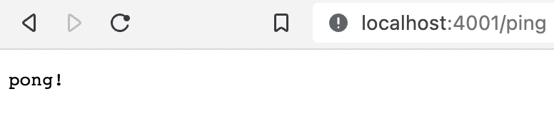
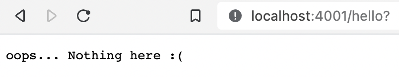

# Webhook

A dummy web server implementation with Cowboy which answers to `GET` and `POST` calls.

- to test, run `mix test`
- to test using the browser, run `iex -S mix` and launch the browser and try the `GET` requests

A valid request:



An invalid request:



## Installation

If [available in Hex](https://hex.pm/docs/publish), the package can be installed
by adding `webhook` to your list of dependencies in `mix.exs`:

```elixir
def deps do
  [
    {:webhook, "~> 0.1.0"}
  ]
end
```

Documentation can be generated with [ExDoc](https://github.com/elixir-lang/ex_doc)
and published on [HexDocs](https://hexdocs.pm). Once published, the docs can
be found at <https://hexdocs.pm/webhook>.

# Reference

This is an updated implementation of the example shown in:

https://dev.to/jonlunsford/elixir-building-a-small-json-endpoint-with-plug-cowboy-and-poison-1826
